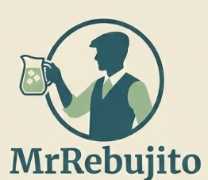
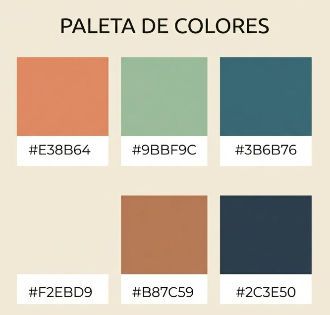
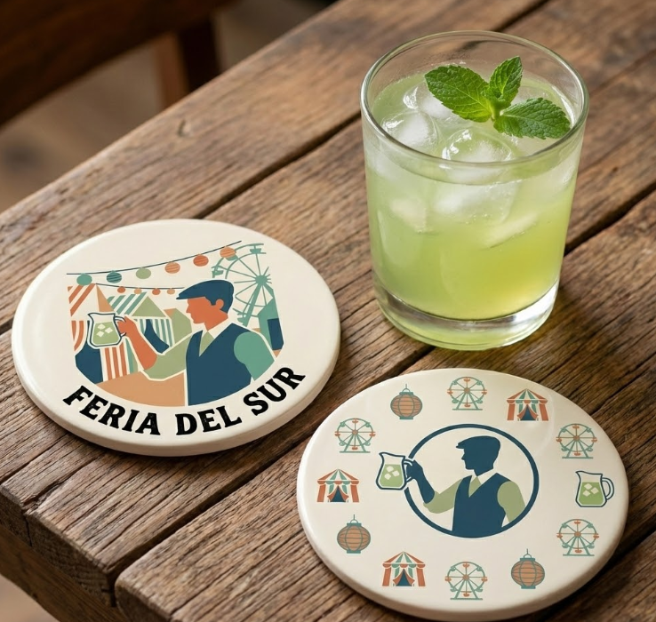

  
  
    

  <h1>🎪 MrRebujito</h1>
  <h3>Gestión Inteligente de Ferias y Casetas</h3>
  
  

    <b>Solución B2G (Business to Government) & B2B.</b> 
    Digitalizamos el trámite de licencias, la gestión de socios y la administración de cartas.
  

  
  
  

---

## 🏗️ Arquitectura del Sistema

MrRebujito se sostiene sobre una arquitectura robusta de tres pilares, diseñada para garantizar la seguridad en los trámites gubernamentales y la agilidad en la feria.

### 1. Backend (Núcleo)

> **Tecnología:**  **Spring Boot**

- Gestión de seguridad y roles (Ayuntamiento vs. Casetero).
- Generación automática de documentación PDF para licencias.
- API RESTful para servir datos a las plataformas cliente.

### 2. Frontend Web (Administración)

> **Tecnología:**  **Angular**

- **Para el Ayuntamiento:** Panel de validación de licencias y control de espacios.
- **Para la Junta Directiva:** Gestión masiva de bases de datos de socios y contabilidad.

### 3. Frontend Mobile (Operativa)

> **Tecnología:**  **Android Nativo**

- **A pie de caseta:** Escaneo de carnets de socios, notificaciones push de estado de licencia y gestión rápida de stock/carta.

---

## 🎨 Identidad Visual y UI

Hemos creado un sistema de diseño que combina la seriedad administrativa con la estética tradicional.

### 🖌️ Logotipo y Variaciones

Nuestra identidad es flexible para adaptarse a documentos oficiales o iconos de app.

  <table>
    <tr>
      <td align="center" width="33%">
        <b>Icono App</b>  
        
      </td>
      <td align="center" width="33%">
        <b>Logo Principal</b>  
        
      </td>
      <td align="center" width="33%">
        <b>Sistema de Iconos</b>  
        
      </td>
    </tr>
  </table>
   
  

### 🌈 Paleta de Colores & Ambiente

Colores tierra y verdes sobrios para transmitir confianza, inspirados en el ambiente de las terrazas y el real.

  
    
  

---

## 👥 Autores y Equipo de Desarrollo

Este proyecto ha sido posible gracias al trabajo conjunto de nuestros equipos de ingeniería.

  <table>
    <tr>
      <th align="center">⚙️ Backend Team (Spring)</th>
      <th align="center">💻 Frontend Team (Angular & Android)</th>
    </tr>
    <tr>
      <td align="left">
        <ul>
          <li><b>Alan Cabezas</b></li>
          <li><b>Juan José Gamero</b></li>
          <li><b>Rafael Lázaro</b></li>
          <li><b>Adrián Linares</b></li>
          <li><b>Juan Montes</b></li>
          <li><b>Oscar Ruiz</b></li>
        </ul>
      </td>
      <td align="left">
        <ul>
          <li><b>Alan Cabezas</b></li>
          <li><b>Juan José Gamero</b></li>
          <li><b>Rafael Lázaro</b></li>
          <li><b>José Manuel Jiménez</b></li>
          <li><b>José Ramón López</b></li>
          <li><b>Oscar Ruiz</b></li>
        </ul>
      </td>
    </tr>
  </table>

---

  Desarrollado con ❤️ y un poco de 🍷 Rebujito. © 2026 IES Francisco Rodríguez Marín.

